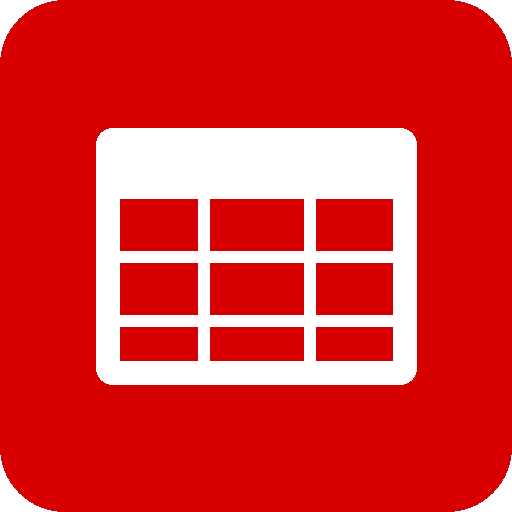
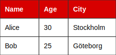

# Rocket.Chat Markdown Tables

A Rocket.Chat App that renders markdown tables beautifully - either as SVG images or ASCII art.

<br clear="left">

## Features

- **Three rendering modes:**
  - **Cards (SVG)** - Beautiful graphical tables, perfect for mobile
  - **Unicode** - Box-drawing characters (┌─┬─┐)
  - **ASCII** - Classic style (+, -, |)
- **Paste from Excel/Sheets** - Tab-separated data is automatically converted to tables
- **Clickable links** - URLs in tables are extracted and shown as clickable links below
- **/tableprefs command** - Users can customize their own display preferences
- **Multilingual** - Help text in 11 languages (auto-detect or admin-configured)
- Parses GitHub Flavored Markdown (GFM) tables
- Supports column alignment (left, center, right)
- Handles emojis correctly

## Installation

### Quick Install (Recommended)

1. **Download** the latest release from [Releases](https://github.com/bamsejon/rocketchat-markdown-tables/releases)

2. **Enable Apps in Rocket.Chat:**
   - Log in as administrator
   - Go to **Administration** (gear icon) → **Settings** → **General** → **Apps**
   - Set **Enable the App Framework** to `True`
   - Set **Enable development mode** to `True` (required for private apps)
   - Click **Save changes**

3. **Install the App:**
   - Go to **Administration** → **Apps** → **Private Apps**
   - Click **Upload App**
   - Select the downloaded `.zip` file
   - Click **Install**
   - When prompted, click **Agree** to accept permissions

4. **Configure (optional):**
   - Go to **Administration** → **Apps** → **Markdown Tables** → **Settings**
   - Choose table style: Cards (SVG), Unicode, or ASCII
   - Configure link display and language preferences

### Build from Source

```bash
# Clone the repository
git clone https://github.com/bamsejon/rocketchat-markdown-tables.git
cd rocketchat-markdown-tables

# Install dependencies
npm install

# Build the app
npm run build

# The zip file will be created in dist/
```

## Usage

### Markdown Tables

Write standard markdown tables in your messages:

```markdown
| Name    | Age | City      |
|---------|-----|-----------|
| Alice   | 30  | Stockholm |
| Bob     | 25  | Göteborg  |
```

### Rendering Modes

**Cards (SVG)** - Clean graphical table, works great on mobile:



**Unicode** - Box-drawing characters:

```
┌─────────┬───────┬───────────┐
│ Name    │ Age   │ City      │
├─────────┼───────┼───────────┤
│ Alice   │ 30    │ Stockholm │
│ Bob     │ 25    │ Göteborg  │
└─────────┴───────┴───────────┘
```

**ASCII** - Classic style:

```
+---------+-------+-----------+
| Name    | Age   | City      |
+---------+-------+-----------+
| Alice   | 30    | Stockholm |
| Bob     | 25    | Göteborg  |
+---------+-------+-----------+
```

### Paste from Excel/Spreadsheets

Copy cells from Excel, Google Sheets, or any spreadsheet and paste directly into Rocket.Chat. Tab-separated data is automatically converted!

### Links in Tables

URLs in table cells are automatically extracted and displayed as clickable links below the table. Use `/tableprefs links off` to disable this.

### User Preferences

Users can customize their own table display:

```
/tableprefs links on    - Show links below tables
/tableprefs links off   - Hide links below tables
```

### Column Alignment

The app supports standard GFM alignment syntax:

```markdown
| Left-aligned | Center-aligned | Right-aligned |
|:-------------|:--------------:|--------------:|
| Left         |    Center      |         Right |
```

## Configuration

Go to **Administration** → **Apps** → **Markdown Tables** → **Settings**

| Setting | Description |
|---------|-------------|
| Table Style | Cards (SVG), Unicode, or ASCII |
| Show links below table | Extract and display clickable links |
| Disable link previews | Prevent automatic URL previews |
| Default show links | Default setting for new users |
| Help text language | Auto-detect or select specific language |

## Requirements

- Rocket.Chat 6.0 or newer
- Apps Framework enabled
- Administrator access for installation

## Troubleshooting

### App doesn't appear after upload
- Make sure **Enable development mode** is set to `True` in Settings → General → Apps
- Try refreshing the page after enabling

### Tables not rendering
- Check that the app is enabled in Administration → Apps → Private Apps
- Verify the app status shows "Enabled"
- Make sure your table has the separator row (e.g., `|---|---|`)

### SVG tables not displaying
- Ensure you're using Cards mode in app settings
- Some older Rocket.Chat versions may not support data URL images

## Changelog

### v1.10.0
- **Bold/italic/code support** - Formatted text now renders correctly in SVG tables
- Text with `**bold**`, `*italic*`, or `` `code` `` displays with proper styling

### v1.9.7
- Fixed SVG rendering when tables contain links
- Improved URL deduplication
- Links displayed before table image for proper rendering

### v1.9.0
- **Cards mode** - SVG table rendering
- **Clickable links** - URLs extracted and shown below tables
- **/tableprefs command** - User preferences
- **Multilingual help text** - 11 languages supported

### v1.8.0
- Extract and display clickable links below tables
- Support both markdown links and plain URLs
- Add setting to toggle link display

## License

MIT

## Author

bamsejon - https://github.com/bamsejon
